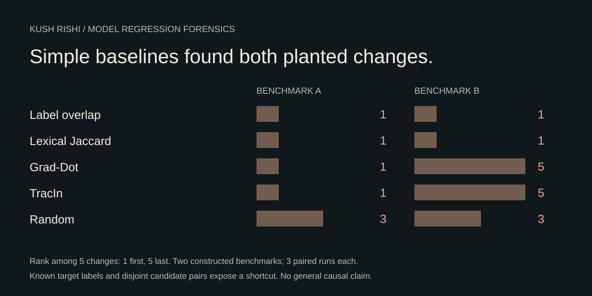

# Model Regression Forensics

Model Regression Forensics studies regressions after training-data changes:

> **When a model regresses after retraining, what evidence is sufficient to identify the training change responsible?**

The completed study focuses on localization. A deterministic follow-up fixture now tests a harder question: when multiple interventions repair the same failed behavior, should a debugger refuse to claim a unique historical cause?

[Visual study](https://kushrishi.com/research/model-regression-forensics) · [Technical report](research/M4_TECHNICAL_REPORT.md) · [Reproduction](research/REPRODUCE_M4.md)



## Completed localization study

Two constructed Banking77 worlds contain five structurally matched label-swap changes each. A pinned DistilBERT classifier was trained across three paired trajectories per world, and rankings were finalized before truth scoring.

| Diagnostic | World 00 root rank | World 01 root rank |
| --- | ---: | ---: |
| Deterministic random reference | 3 | 3 |
| Target-label overlap | 1 | 1 |
| Lexical Jaccard | 1 | 1 |
| Final-checkpoint Grad-Dot | 1 | 5 |
| Seven-checkpoint TracIn | 1 | 5 |

Simple visible-change baselines localized the planted change in both worlds. The evaluated model-based diagnostics added no top-1 benefit in this design.

The target labels are known and candidate label pairs are disjoint, which gives the simple label-overlap baseline a semantic shortcut. These are results from **two benchmark worlds**; the three paired trajectories within each world are repeated trainings, not independent benchmark worlds.

## What this result means

The project keeps three questions separate:

- **Localization:** which change looks suspicious?
- **Restoration:** does reversing a change repair the failed behavior?
- **Specificity:** is that repair distinguishable from plausible alternative repairs and retraining variability?

The completed matched study evaluates localization. It does not establish general root-cause identification or superiority to modern training-data attribution methods.

The follow-up repair example tests this distinction directly: two interventions restore the same predictions, so the assessment reports ambiguity.

## Comparison utility

The repository also contains an experimental exact-label release comparison utility. It validates record alignment, declared evaluation slices, and accuracy-drop tolerances. An external handwritten-digits fixture agrees with an independent NumPy reference.

That checks implementation arithmetic; it does not identify the cause of a regression.

## Read and reproduce

- [Technical report](research/M4_TECHNICAL_REPORT.md)
- [Experiment history](research/EXPERIMENT_HISTORY.md)
- [Reproduce the recorded results](research/REPRODUCE_M4.md)
- [Accepted result record](research/M4_RESULT.json)
- [External comparison fixture](docs/external-release-task.md)

With Python 3.12 or later and `uv`:

```bash
uv sync --extra dev
uv run ruff check .
uv run ruff format --check .
uv run pytest
```

Replaying the saved scoring records does not retrain the models. Research-only numerical checks have additional optional dependencies documented in the repository.

## Ambiguous repair fixture

A deterministic linear-model fixture now contains one regression and two distinct interventions that both restore the baseline predictions exactly: restoring the original feature order, or keeping reversed inputs while reversing the model weights.

The same release-comparison policy marks both repairs successful. The specificity layer therefore returns `ambiguous_repairs` and leaves the historical cause `not_identified`. The known historical change is not provided to that decision layer.

[Read the fixture](docs/ambiguous-repairs.md)

## Next study

Build candidate changes with overlapping target labels and plausible semantic alternatives. Test simple visible-change baselines before larger training runs, then compare ranking, recovery, alternative repairs, ambiguity and computational cost.

The follow-up must define a useful debugging decision beyond existing causal diagnosis and training-data attribution. The [continuation criteria](research/M4_CONTINUATION_GATE.md) still apply. The [experiment history](research/EXPERIMENT_HISTORY.md) retains unsuccessful designs and the reasoning behind this direction.

## Limits

MRF does not currently establish causal attribution, generalization beyond the evaluated setting, superiority to attribution methods, or a published paper.
