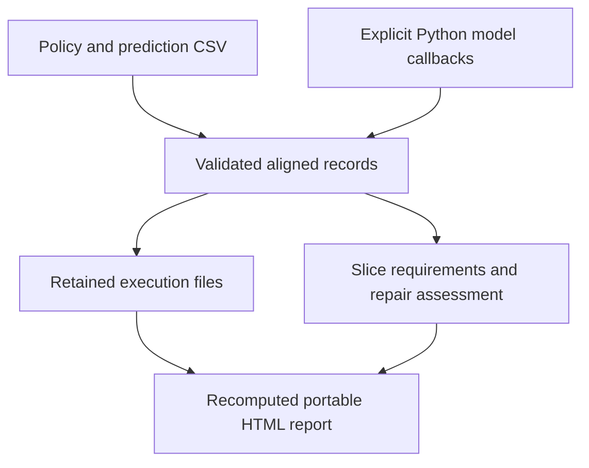

# Software architecture

MRF has two distinct uses: investigate supplied classification predictions and
reproduce historical research experiments. The application does not depend on
running the historical training pipelines.

## Investigation path

| Component | Responsibility | Important boundary |
| --- | --- | --- |
| `import_predictions.py` | Import policy and saved predictions; retain source bytes and hashes | No model loading or inferred execution cost |
| `investigation.py` | Execute caller-supplied baseline, candidate and repair functions once | Caller controls resource limits; completed records survive later failure |
| `release_compare.py` | Validate identical case sets; measure exact-label slice accuracy | Declared thresholds are engineering requirements, not significance tests |
| `repair_compare.py`, `specificity.py` | Assess supplied repairs under an identical policy | A passing repair does not identify unique historical cause |
| `investigation_report.py`, `case_previews.py` | Recompute assessments and render escaped local HTML | Supplied records/previews are not authenticated model executions |
| `incidents.py`, `artifact_verify.py` | Experimental incident schema and optional local payload verification | Hash verification establishes byte identity, not causal truth |

The importer accepts baseline and candidate predictions for an initial comparison,
including candidates that pass the policy. Its `initial-release-comparison/0.1`
report uses `candidate` and marks repair assessment `not_evaluated`. The saved plan
explicitly records `investigation_stage: initial_comparison`; an incomplete repair
investigation is not silently reinterpreted as an initial comparison.

When repairs are supplied, the existing repair assessment requires a candidate
that fails at least one declared requirement. Import success and policy success
are different: inspect the report rather than treating exit zero as a passing
release. Reopening recomputes either stage from retained predictions.

## Historical research implementation

`task.py`, `exp007.py`, `exp008.py`, `certification.py`, training/evaluation code
and their numbered scripts retain the constructed-task investigations.
`exp009_*` modules retain Banking77 construction, classifier training, paired
trajectories, attribution and the matched localization study. The associated
protocols, source fingerprints and tests define reproduction; module names are
historical identifiers, not supported end-user commands.

Do not merge those experiments into the current application simply to reduce
file count. Changes to shared numerical behavior need evidence that retained
results and frozen definitions still mean the same thing. See the
[experiment history](../research/EXPERIMENT_HISTORY.md) and
[reproduction procedure](../research/REPRODUCE_M4.md).

## Development and dependencies

The saved-prediction application requires only the base package dependencies.
The `research` extra adds model-training libraries; example-specific pinned
requirements are documented with each walkthrough. Core CI runs unit tests and
style checks. Research CI exercises optional numerical modules; browser CI checks
case inspection and export in a regenerated report.

The current large historical modules are a maintenance cost, not a reason to
rewrite a completed study during presentation cleanup. Keep application changes
focused and preserve its small installation path.
